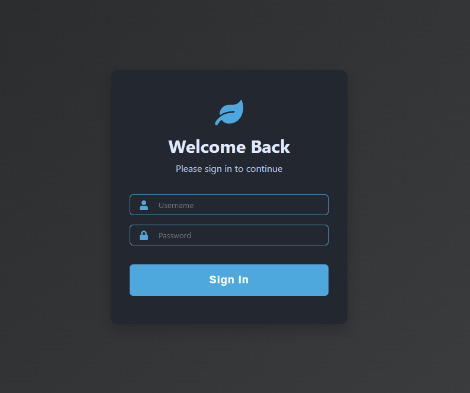
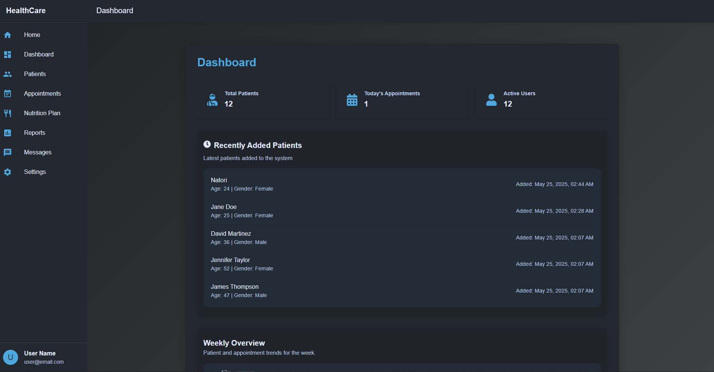

# Project2_soft

## Project Overview
This system is a Nutrition Clinic Management System designed to streamline clinic operations, manage patient records, appointments, nutrition plans, and facilitate communication between staff and patients. The goal is to provide an efficient, user-friendly platform for both clinic administrators and patients.

## Technology Stack
- **Frontend:** React.js (JavaScript)
- **Backend:** Node.js with Express.js
- **Database:** MongoDB (NoSQL)
- **Other:** RESTful API architecture, Recharts for data visualization

## Features
- Patient registration and management
- Appointment scheduling
- Nutrition plan creation and tracking
- Dashboard with analytics and reports
- Secure authentication

## Database
The system uses **MongoDB**, a NoSQL document-oriented database, to store patient information, appointments, nutrition plans, and other clinic data. MongoDB is chosen for its flexibility, scalability, and ease of integration with Node.js.

## GUI Screenshots

Below are some screenshots of the application's user interface:

### Login Page

### Dashboard

### Patient List

### Nutrition Plan

### Schedule Appointments

emphasis on trial github
